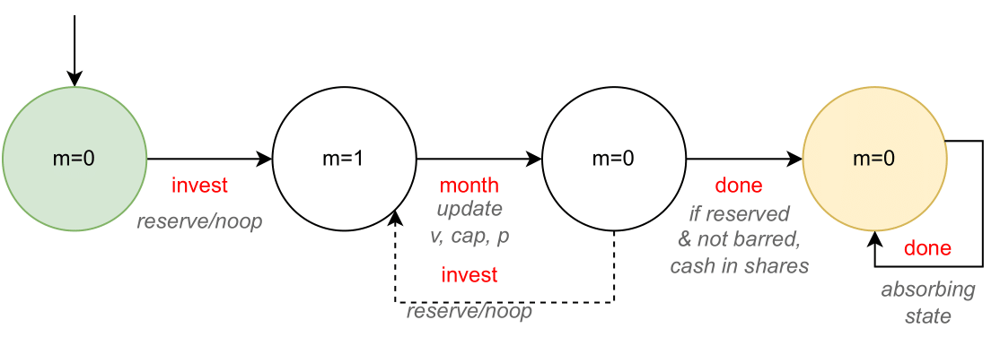
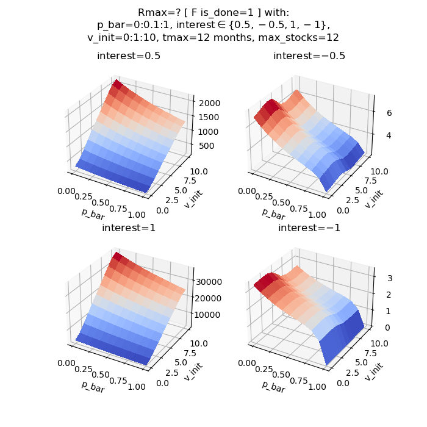
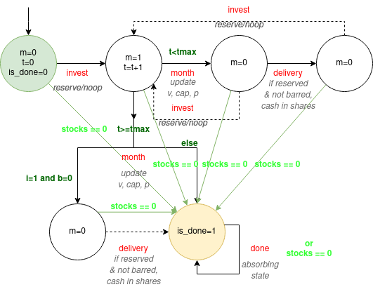
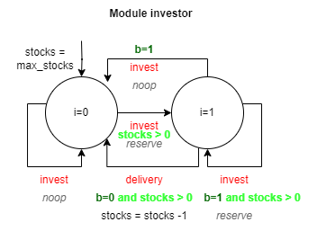
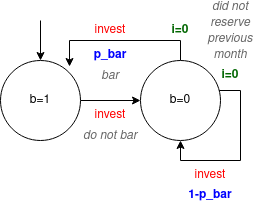

# Logbooks

(S): Stéphane Nguyen
(T): Tansen Rahman

(S&T): Both

## Week 0 & 1: 20.02.2023 - 26.02.2023 & 27.02.2023 - 05.03.2023

Getting started, getting an idea of probabilistic model checking.
### Resources consulted:
* (T)[Project 6: CTL model checker without "pre"](https://citeseerx.ist.psu.edu/viewdoc/download?doi=10.1.1.469.1817&rep=rep1&type=pdf): Reading the paper before choosing which project to take.

> The goal of this project is to formalise and implement a simple CTL model checker without "pre".
Resources:
CTL Model Checking Based on Forward State Traversal: A paper describing a CTL model checking algorithm based on forward state traversal.

We decided to move forward with PRISM as it was more interesting and had less of an initial learning curve.

* (S&T)[PRISM website](https://www.prismmodelchecker.org/): Installation of PRISM, discovered that PRISM can be applied on a wide range of probabilistic models:
    - discrete-time Markov chains (DTMCs)
    - continuous-time Markov chains (CTMCs)
    - Markov decision processes (MDPs)
    - probabilistic automata (PAs)
    - probabilistic timed automata (PTAs)
    - partially observable Markov decision processes (POMDPs)
    - partially observable probabilistic timed automata (POPTAs) 

and discovered that PRISM uses BDDs and MTDDs (Multi terminal decision diagrams)
> PRISM incorporates state-of-the art symbolic data structures and algorithms, based on BDDs (Binary Decision Diagrams) and MTBDDs (Multi-Terminal Binary Decision Diagrams)

* (S)[Brief look at PRISM syntax for modelling a PTA: Probabilistic Timed Automata](https://www.prismmodelchecker.org/talks/dave-cav11.pdf): Can intuitively define a PTA (at least the one in the presentation slide)

* (S&T)[Tutorial Part 1](https://www.prismmodelchecker.org/tutorial/die.php): Getting started with PRISM on simple dice example (DTMC: Discrete Time Markov Chain).
**PRISM** have at least these:

    **Model**
    - Can define easily a basic DTMC model in PRISM from the graphical representation of the DTMC model.
    - Can add basic rewards counting the number of steps. Therefore, can ask (in the property tab) what is the average number of steps we get a dice number.
    - Need to specify what kind of model it is: DTMC ? MDP (Markov Decision Process) ? etc.

    **Simulator**
    - Can simulate/sample paths in the DTMC
    - Can choose manually which transition to take
    - Can reset the path
    - Can choose the number of steps to take in the system.

    **Properties**
    - Can ask what is the probability that a property is true.
    - Can verify/check whether the probability, e.g bigger or equal to some value is true.
    - Can ask what is the expected cumulative reward (see expected return without discount in reinforcement learning) with some conditions.
    - Can plot via "Experiments" for example the probabilities that a property is true with different values of a variable. Can export the graph, modify legends etc. Can also use simulations to estimate empirically the probabilities instead of their iterative algorithm (dependent on what kind model we have)

    **Options**
    - Can change solution methods (e.g MDP solution method from Value Iteration to Policy Iteration or to Linear Programming etc.)
    - Can change "accuracy"/"stopping condition" by changing termination criteria and termination epsilon.

* (S)[(Theory) PCTL](https://en.wikipedia.org/wiki/Probabilistic_CTL): brief look at what it is. Essentially, it is CTL extended to real time probabilistic models. PCTL is used to **check DTMC** models.
    - More flexibility than ALL paths or EXIST one path due to the **probabilities**.
    - More flexibility if want to verify that properties **hold within some time period/unit** (e.g 4 seconds).

* (S)[(Theory) PCTL more formal details and explanation on why it's an extension of CTL](https://citeseerx.ist.psu.edu/document?repid=rep1&type=pdf&doi=ed5c504d718ec782b0c1db81d5fd6c36f268aee4): See section 3 for properties expressible with PCTL.

* (S)[P operator in PRISM](https://www.prismmodelchecker.org/manual/PropertySpecification/ThePOperator):
    - `P bound [ pathprop ]` informally expresses "the probability that path property pathprop is satisfied by the paths from state s meets the bound bound" (quote from the link)
    - Specifying properties in PRISM does not require users to explicitely specify what model checking to use.

* (S)[PRISM FAQ, Max model size](https://www.prismmodelchecker.org/manual/FrequentlyAskedQuestions/PRISMModelling#max_model_size):
    - The number of states can be around $10^7$
    - Variable ordering matters:
    > Because PRISM is a symbolic model checker, the amount of memory required to store the probabilistic model can vary (sometime unpredictably) according to several factors. One example is the order in which the variables of your model appear in the model file. In general, there is no definitive answer to what the best ordering is but the following heuristics are a good guide.

* (T)Presentation slides

### Current objective(s):
* Understand some limitations of PRISM (about property verification or efficiency/optimization/performance etc.) (e.g order of the lines in the model description affects efficiency due to the construction of BDDs or MTBDDs ([See FAQ of PRISM](https://www.prismmodelchecker.org/manual/FrequentlyAskedQuestions/PRISMModelling#max_model_size))) 

* More case studies than just Dice example from tutorial

### Next goal(s):
* Limitations of PRISM:
    - What about big models ? Can we import data "into PRISM language" ? (Maybe dive into [explicit models](http://www.prismmodelchecker.org/manual/Appendices/ExplicitModelFiles))
* Theory: start reading [PRISM lectures](https://www.prismmodelchecker.org/lectures/pmc/)
* PRISM: start reading the other tutorials and the manual
* More PRISM case studies and [survey](https://www.prismmodelchecker.org/papers/arcras-pmc.pdf).

## Issues:
* Installation on Windows 10 due to Java version: Not fixed yet but no issue installing on linux.

## Week 2: 06.03.2023 - 12.03.2023

### Resources consulted:
* (S) [Quick peak at computation engines](http://www.prismmodelchecker.org/manual/ConfiguringPRISM/ComputationEngines)

* (S) [Quick peak at PCTL in the PRISM lectures](https://www.prismmodelchecker.org/lectures/pmc/05-dtmc%20model%20checking.pdf): Took a brief look at the syntax and `Prob(X φ)`

* (S&T) [Quick peak at some case studies](http://www.prismmodelchecker.org/casestudies/index.php). Discovered that we can "combine two such processes in asynchronous parallel composition" in order to create for example multiple philoshophers without rewriting everything because philosophers behave similarly. Many interesting applications, such as randomized code, detecting security breaches.

### Current objective(s):
* Same as previously but with a bigger focus on case studies.

### Next goal(s):
* Limitations of PRISM:
    - What about big models ? Can we import data "into PRISM language" ? (Maybe dive into [explicit models](http://www.prismmodelchecker.org/manual/Appendices/ExplicitModelFiles))
* ~~Theory: start reading [PRISM lectures](https://www.prismmodelchecker.org/lectures/pmc/)~~ (Deemed less important. We must focus on an interesting case study with real life applications)
* PRISM: start reading the other tutorials and the manual
* More PRISM case studies and [survey](https://www.prismmodelchecker.org/papers/arcras-pmc.pdf).

## Week 3: 13.03.2023 - 19.03.2023

### Resources consulted:
* (S)[PRISM filters](http://www.prismmodelchecker.org/manual/PropertySpecification/Filters): We can get the set of states, check from multiple states instead of just the initial state. How to specify multiple initial states in the model ?
* (S)[PRISM many expressions](http://www.prismmodelchecker.org/manual/ThePRISMLanguage/Expressions): negation, if and only if, implication, log, modulo etc.
* (S)[PRISM limitation, no for loops, no lists or compact way to write the following in the Bluetooth case study](http://www.prismmodelchecker.org/casestudies/bluetooth.php)

```
[reply]  receiver=2 & y1=0 -> 1/(maxr+1) : (receiver'=3) & (y1'=0) // reply and make random choice
	                    + 1/(maxr+1) : (receiver'=3) & (y1'=2*1)
	                    + 1/(maxr+1) : (receiver'=3) & (y1'=2*2)
	                    etc.
                         + 1/(maxr+1) : (receiver'=3) & (y1'=2*127)
```
where `maxr` was 127.
* (S&T)[PRISM publications (both internal and external)](https://www.prismmodelchecker.org/publ-lists.php)
* (S&T)[PRISM benchmark suite](https://www.prismmodelchecker.org/benchmarks/): List of possible interesting properties one can check for different models.


### Current objective(s):
* Look into game case studies using PRISM-games extension. See [PRISM-games](https://www.prismmodelchecker.org/games/).
* Pick an interesting case study the above or from general [PRISM publications](https://www.prismmodelchecker.org/publ-lists.php).
* Look into ideas of our own case study. Possible game theory problem, such as markets with buyers and sellers. Can investigate properties like what is the probability that x product is sold out?
* Find more limitations of PRISM:
    - What about big models ? Can we import data "into PRISM language" ? (Maybe dive into [explicit models](http://www.prismmodelchecker.org/manual/Appendices/ExplicitModelFiles))
    - Can we have reward distributions ?
    * Known limitation: [no for loops, no lists or compact way to write the following in the Bluetooth case study](http://www.prismmodelchecker.org/casestudies/bluetooth.php)

```
[reply]  receiver=2 & y1=0 -> 1/(maxr+1) : (receiver'=3) & (y1'=0) // reply and make random choice
	                    + 1/(maxr+1) : (receiver'=3) & (y1'=2*1)
	                    + 1/(maxr+1) : (receiver'=3) & (y1'=2*2)
	                    etc.
                         + 1/(maxr+1) : (receiver'=3) & (y1'=2*127)
```

### Next goal(s):

* More on reward distributions ? [Reward based properties](http://www.prismmodelchecker.org/manual/PropertySpecification/Reward-basedProperties)
* Non determinism vs probabilistic ? [MDP non determinism](https://www.prismmodelchecker.org/lectures/biss07/04-mdps.pdf)
* State-space explosion and "solutions" [Advanced topics](https://www.prismmodelchecker.org/lectures/biss07/11-advanced%20topics.pdf) 

## Week 4: 19.03.2023 - 26.03.2023

### Resources consulted or work done:
* (T) Prepared presentation slides and content for the second presentation.

* (S)[Turned-Based stochastic game definition](https://www.prismmodelchecker.org/papers/arcras-pmc.pdf): We saw very briefly that a Turned-based stochastic game is an extension of a Markov Decision Process for multiple players where some states from the MDP "uniquely belong" to some players. In other words, a player can only play/make decisions in some states.

* (S&T)[Futures Market Investor case study](https://www.prismmodelchecker.org/casestudies/investor.php): Tansen found this MDP case study. It might be interesting to extend it or take inspiration from it.
    - Adding more rewards
    - Adding more investors, multiplayer (maybe Turned-based stochastic game in PRISM-games)
    - etc.

We (S&T) modified the case study to introduce:

```
module my_done_module
    is_done : [0..1] init 0; 
    [done] is_done=0 -> (is_done'=1);
    // Move the absorbing state to this one below where we don't get any reward !
    [absorb] is_done=1 -> (is_done'=1);
endmodule
```
and
```
rewards
    [done] true : v;  // reward from transition [done]
endrewards
```
see files in `../presentation/presentation_2` folder and the next bullet point.

(T) also modified
```
// bar on the investor
module barred
    
    b : [0..1] init 1; // initially cannot bar
    // b=0 - not barred and b=1 - barred

    [invest] true  -> (b'=0); // do not bar this month
    [invest] (b=0) -> (b'=1); // bar this month (cannot have barred the previous month) 

endmodule
```
to
```
// bar on the investor
module barred

    b : [0..1] init 1; // initially cannot bar
    // b=0 - not barred and b=1 - barred

    [invest] (b=1) -> (b'=0); // do not bar this month
    [invest] (b=0) -> 0.3: (b'=1) + 0.7: (b'=0); // bar this month (cannot have barred the previous month) 
    
endmodule
```
but (S) changed it to:
```
// bar on the investor
module barred

    b : [0..1] init 1; // initially cannot bar
    // b=0 - not barred and b=1 - barred

    [invest] (b=1) -> (b'=0); // do not bar this month
    [invest] (b=0) -> p_bar: (b'=1) + (1-p_bar): (b'=0); // bar this month (cannot have barred the previous month) 
    
endmodule
```
and added constants that can be used in the [experiments](https://www.prismmodelchecker.org/manual/RunningPRISM/Experiments).
```
const double p_bar;
const int v_init;
```
and changed `v : [0..10] init 10` into `v : [0..10] init v_init;`

* (S) PRISM limitation; no direct way to check a property on a transition based on a transition label: No direct way for example to ask what is the expected cumulative reward/return from the initial state until reach an absorbing state but where we don't know its explicit expression. Where we only know the transition label from which we can reach this absorbing state.

One way is to add a variable that will be used to track the absorbing state via the transition label:
```
module my_done_module
    is_done : [0..1] init 0; 
    [done] true -> (is_done'=1 );
endmodule
```
However, if we also have this:
```
rewards
    [done] true : v;  // reward from transition [done]
endrewards
```
It would create infinite rewards because of the absorbing state having the "done" transition that has a transition reward attached to it.
Therefore, we have to replace our `my_done_module` by:
```
module my_done_module
    is_done : [0..1] init 0; 
    [done] is_done=0 -> (is_done'=1);
    // Move the absorbing state to this one below where we don't get any reward !
    [absorb] is_done=1 -> (is_done'=1);
endmodule
```
We can then verify some properties using `is_done`.

* (S) Provided a Python code plotting a time series for the Futures Market Investor:


* (S) Provided a Python code showing a surface plot replicated the one in the case study (after exporting PRISM experiment as a list in CSV):


Surface plot from the case study:


### Current objective(s):
* Look into game case studies using PRISM-games extension. See [PRISM-games](https://www.prismmodelchecker.org/games/).
* Extend the Futures Market Investor case study
* Find more limitations of PRISM:
    - What about big models ? Can we import data "into PRISM language" ? (Maybe dive into [explicit models](http://www.prismmodelchecker.org/manual/Appendices/ExplicitModelFiles))
    - Can we have reward distributions ?
    - Known limitation: No direct way to check a property on a transition based on a transition label
    - Known limitation: [no for loops, no lists or compact way to write the following in the Bluetooth case study](http://www.prismmodelchecker.org/casestudies/bluetooth.php)

### Next goal(s):

* More on reward distributions ? [Reward based properties](http://www.prismmodelchecker.org/manual/PropertySpecification/Reward-basedProperties)
* Non determinism vs probabilistic ? [MDP non determinism](https://www.prismmodelchecker.org/lectures/biss07/04-mdps.pdf)
* State-space explosion and "solutions" [Advanced topics](https://www.prismmodelchecker.org/lectures/biss07/11-advanced%20topics.pdf) 

## Issues:
* (S) PRISM warning us that we had deadlocks with 
```
module my_done_module
    is_done : [0..1] init 0; 
    [done] (is_done=0) -> (is_done'=1 );
endmodule
```
We fixed it by writing `true` (includes `(is_done=1)`) instead of `(is_done=0)` alone. However, no need to use these if we use (which is what we're using):
```
module my_done_module
    is_done : [0..1] init 0; 
    [done] is_done=0 -> (is_done'=1);
    // Move the absorbing state to this one below where we don't get any reward !
    [absorb] is_done=1 -> (is_done'=1);
endmodule
```
because `is_done` is always $0$ at the beginning then changes to $1$. From $1$, we can never go back to $0$ so it's fine. The "absorb" transition is the only one used from the absorbing states having `is_done=1`.

* (S) `Rmax=?[F is_done=1]` giving infinite rewards in our modified Futures Market Investor case study. Might be because there's some [non-zero proba that we never end up in a state with this property](http://www.prismmodelchecker.org/manual/FrequentlyAskedQuestions/PRISMProperties#inf_rewards). However, `Rmax=?[C<=t]` works/gives values (using the iterative algorithm; Value Iteration) that correspond to the case study (see probability to bar at $0.3$ for initial value $v=10$. The maximum expected sale price is 9.5):


However, if we use "simulation", it will lead to different values:


PRISM warned us by saying `Warning: For simulation, nondeterminism in MDP is resolved uniformly (resulting in DTMC).` Therefore, we shouldn't use "simulations"
for these kind of tasks (because there's no reinforcement learning involved).

## Week 5: 27.03.2023 - 02.04.2023

### Resources consulted or work done:
* (S&T) Brainstormed ideas for extending the Futures Market Investor:
    - (S) Investor can reinvest into the market.
    - (S) We can change the end condition to a time limit, so we can look at properties in respect to some time metric.
    - (T) We can add some time reward to the investments.
    - (S&T) We can add another investor and analyze properties using PRISM-games.
    - (T) We can implement an actual future, where two investors/players need to agree on a price now, and execute the trade later.
    - (T) We can also implement rollover in order to potentially increase their return.
    - (T) We will need to add some conditions to avoid a zero-sum game case where nothing in the market occurs, since the players will never be able to agree on a price.
    - (T) We could add commissions for buying/selling stock -> changes to non-zero sum game.

* (S) Implemented some of the above ideas (see `../presentations/presentation_3/` folder):
    - Can have more than one investment/delivery within time horizon. This extension breaks "If in a given month the investor does not reserve, then at the very next month the market can temporarily bar the investor from reserving. But the market cannot bar the investor in two consecutive months."
    - The market cannot bar initially and cannot bar the investor in two consecutive months. **The market can bar even if the investor reserved the previous month !**
    - Time horizon. Fixed number of months until reaches absorbing state.
    - Variable tracking the month.
    - Can also deliver last month

    

### Current objective(s):
* Look into game case studies using PRISM-games extension. See [PRISM-games](https://www.prismmodelchecker.org/games/).
* Extend the Futures Market Investor case study
* Find more limitations of PRISM:
    - What about big models ? Can we import data "into PRISM language" ? (Maybe dive into [explicit models](http://www.prismmodelchecker.org/manual/Appendices/ExplicitModelFiles))
    - Can we have reward distributions ?
    - Known limitation: No direct way to check a property on a transition based on a transition label
    - Known limitation: [no for loops, no lists or compact way to write the following in the Bluetooth case study](http://www.prismmodelchecker.org/casestudies/bluetooth.php)

### Next goal(s):

* More on reward distributions ? [Reward based properties](http://www.prismmodelchecker.org/manual/PropertySpecification/Reward-basedProperties)
* Non determinism vs probabilistic ? [MDP non determinism](https://www.prismmodelchecker.org/lectures/biss07/04-mdps.pdf)
* State-space explosion and "solutions" [Advanced topics](https://www.prismmodelchecker.org/lectures/biss07/11-advanced%20topics.pdf) 

## Week 6: 03.04.2023 - 09.04.2023

### Resources consulted or work done:

* (S) Verified some properties based on current extended market investor model:
    - We already had `Rmax=? [ C<=t ]`
    - `Rmax=? [ F is_done=1 ]` now works ! So we can use it instead of the previous formula even though the previous one can be used to check implicitely the number of steps.
    - `Pmin=? [F<=(2*tmax+1) is_done=1]` is it unreachable in the worst case within this amount of steps ? Can we complete all the months within this amount of steps ? (Note that tmax was the maximum number of months). It might be better to rename `tmax`.
    - `Rmin=? [ F is_done=1 ]` What is the minimum reward you can accumulate until reach the end ? (This needs to be fixed because there's a warning in PRISM stating: `Warning: PRISM hasn't checked for zero-reward loops. Your minimum rewards may be too low...`)
    - `Pmin=? [F<=(3*tmax+1) is_done=1]` What is the worst probability to reach the end state within 3 tmax + 1 steps (recall that we have the transitions labelled: `invest`, `month`, `delivery` and `done` (once at the end if do not take into account the infinite loop with the absorbing state). The maximum number of steps is when an investor tries to invest every month).
    - `Pmax=? [F<=(2*tmax+1) is_done=1]` What is the best probability to reach the end state within 2 tmax + 1 steps ? If it's a probability of $1$, then it's possible to reach it within the described number of steps.
    - `Pmax=? [F<=tmax is_done=1]` What about within tmax steps ?  If the probability is $0$, it's impossible to finish earlier.
    - More generally: `Pmax=? [F<=t is_done=1]` and `Pmin=? [F<=t is_done=1]` and then can use "experiments" to compute the probabilities for different values of the variable `t`.
    - Utilized a second reward structure to get the maximum number of steps and (`R{"steps"}max=? [F is_done=1]`) minimum number of steps to reach the end state. We can see below that the more the market bars, the less the maximum number of steps is until we reach the end (recall that step is not month, it's a transition within the MDP. Moreover, when the investor gets barred, there's no delivery so less step).

    
     
    - Plotted the maximum reward just like for the market investor case study (by using PRISM experiments, exported the data in CSV and using python for the plot) but this time using our new model. On the left we have the Market Investor Case Study and on the right we have the extended/current model.

{width=260}
{width=260}


* (S) Started to think about multiple [reward structures](http://www.prismmodelchecker.org/manual/PropertySpecification/Reward-basedProperties) and nested properties. What are the limitations in terms of nested properties ? Can we reuse a result obtained by verifying another property ?

 > If you don't specify a reward structure to the R operator, by default, the first one in the model file is used

### Current objective(s):
* Look at multiple modules & reward structures.
* Is it possible to have a reward property giving some value inside a P property ? 
* Look into game case studies using PRISM-games extension. See [PRISM-games](https://www.prismmodelchecker.org/games/).
* Extend the Futures Market Investor case study
* Find more limitations of PRISM:
    - What about big models ? Can we import data "into PRISM language" ? (Maybe dive into [explicit models](http://www.prismmodelchecker.org/manual/Appendices/ExplicitModelFiles))
    - Can we have reward distributions ?
    - Known limitation: No direct way to check a property on a transition based on a transition label
    - Known limitation: [no for loops, no lists or compact way to write the following in the Bluetooth case study](http://www.prismmodelchecker.org/casestudies/bluetooth.php)

### Next goal(s):

* More on reward distributions ? [Reward based properties](http://www.prismmodelchecker.org/manual/PropertySpecification/Reward-basedProperties)
* Non determinism vs probabilistic ? [MDP non determinism](https://www.prismmodelchecker.org/lectures/biss07/04-mdps.pdf)
* State-space explosion and "solutions" [Advanced topics](https://www.prismmodelchecker.org/lectures/biss07/11-advanced%20topics.pdf) 

## Week 7: 10.04.2023 - 16.04.2023

### Resources consulted or work done:

* (T) Addressed some of the previous issues:
    - Can have more than one investment/delivery within time horizon. This extension breaks "If in a given month the investor does not reserve, then at the very next month the market can temporarily bar the investor from reserving. But the market cannot bar the investor in two consecutive months." Debatable whether it needs fixing, as the wording was due to having "invest" be the end state, however we can keep the extension as stated if we add a simple check on the value of i:
    ```
    module barred
        // bar this month (cannot have barred the previous month), only when investor did not invest last month 
        [invest] (b=0) & (i=0) -> p_bar: (b'=1) + (1-p_bar): (b'=0); 
    endmodule
    ```

    - We had previously added a simple reward of v, but a time variable reward makes more sense. We can define a monthly interest (double) and consider accrued interest with the following:

    ```
    const double interest;
    rewards
        // reward from transition [delivery], accrued monthly interest
        [delivery] true : v * (1 + pow(interest, (tmax - time)));  
    endrewards
    ```
    
### Current objective(s):
* Start learning PRISM-games, as many of the remaining ideas for extensions rely on it.
* Look at multiple modules & reward structures.
* Is it possible to have a reward property giving some value inside a P property ? 
* Continue to extend the Futures Market Investor case study

## Week 8: 17.04.2023 - 23.04.2023

### Resources consulted or work done:

* (T) Investigated synchronous behaviour when attempting to simplify code.
    - The following [month] transition seemed to be useless as it just lead to the [delivery] transition. I attempted to combine the cash-in with the transition to the final state with the following change:
    ```
    [month] (i=1) & (b=0) & (m=1) & (time >= tmax) & (is_done=0) -> (m'=0); 
    // If last month and but invested, still want to cash in the shares.

    [delivery] (m=0) & (time >= tmax) & (is_done=0) -> (is_done'=1);
    ```
    to:
    ```
    [delivery] (i=1) & (b=0) & (m=1) & (time >= tmax) & (is_done=0) -> (is_done'=1);
    ```
    - However, this prevented the value of the share being updated at that last month before being cashed in, which is not what we wanted. This update, which is through the transition state [month], was not processed. This is because the "month" module still has [month] transitions that do not hold. Therefore, I kept the old version (no change).
    - While not explicitly said in PRISM documentation, by investigating the model behaviour, synchronous transitions only occur when all modules have a valid action for that synchronous transition. Modules that do not contain any action for that synchronous transition do not cause any issues. 
    - In short, for a synchronous transition, we have a boolean AND among all modules, and an OR within each individual module.
* (T) Prepared slides for third presentation.
* (T&S) Started writing report.
* (S) Made a transition model (for the three first modules as the others can be represented via other ways, see plot for the market price dynamics) representing our extension to the Investor Case Study, now easier to do with our current understanding of synchronous transitions and actions. It can help further understanding the model, extending it, verify it.

{width=320}
{width=260}
{width=260}

The first one can be used to understand how everything is synchronized or linked together via the `invest`, `month`, `delivery` and `done` labelled transitions.
In gray, we have some comments. In red, we have transition labels. In green, we have some conditions (if true, transit) and in blue with have probabilities of transitioning ! However, when we have both a green text and blue text on a transition, the blue part would be a conditional probability (given the green part being true); if the green part is true, then we transition with the blue probability.
When one has more than two out-links, it's either due to the non-determinism (when no investor strategy given) or it has some hidden conditions coming from other modules.

There are also dashed lines/links, they are used because we don't exactly go to the exact same state as previously. Even though a line/link is not dashed, it doesn't necessarily mean we go to same state that we already went through it (but it has at least the same variables values and only variables from the module).

Note that the initial state always contains all the variables from the module (and initialized to some values). Moreover, some variables from other modules can be used in a module in the "precondition"/"guard" part (left part of `->` in PRISM models).

* (S) same but for the model that we used in the previous presentation:

{width=320}
{width=260}
{width=260}

We can see, via the graph, why the previous model could loop infinitely (no finite time horizon) (fixed by Stephane). One can also see why extending the model where one can cash in many times would make it possible for the market to bar the investor even though he reserved in previous month (issue found by Stephane and fixed by Tansen, see previous week logs). We can also easily see why we can have an infinite cumulative reward if the reward comes from the `done` transition (fixed more than a week ago by Stephane by separating into two transition labels: `delivery` and `done`).

* (S) The extension from Tansen:
    ```
    const double interest;
    rewards
        // reward from transition [delivery], accrued monthly interest
        [delivery] true : v * (1 + pow(interest, (tmax - time)));  
    endrewards
    ```
    can be thought of as using the money earned and reinvesting it somewhere and retrieving all the gains the end of the time horizon (includes compounded interest).

* (S): Renamed `properties.props` to `all_properties.props` and created `properties.props` containing only $6$ properties:
```
const int t;

Rmax=? [ F is_done=1 ]
Rmin=? [ F is_done=1 ]
Pmax=? [ F<=t is_done=1 ]
Pmin=? [ F<=t is_done=1 ]
R{"steps"}max=? [ F is_done=1 ]
R{"steps"}min=? [ F is_done=1 ]
```
* (S): Used PRISM CLI to get experiments' results for $4$ quantitative properties we specified previously and for interest=0, tmax=12 months.

```
prism investor_verification.nm properties.props -prop 1,2,5,6 -const p_bar=0:0.1:1,interest=0,v_init=0:1:10,tmax=12 -exportresults all_res.csv:csv
```

where the property number corresponds to the property order in the `properties.props` file in which they appear.

* (S): Used Python to show the results via surface plots:


where within tmax=12 months with no reinvestment into a bank or whatsoever (meaning interest=0):
 - The first property (top left) shows the maximum cumulative reward/money the investor can get. We can see that the less likely the market bars, the higher the maximum reward was expected.
 - The second property (top right) shows the minimum cumulative reward/money the investor can get. It's $0$ because the investor can just do `noop` all the time. In other words, the investor never reserves. Note that it's independant of `v_init` and `p_bar`.
 - The third property (bottom left) shows the maximum number of steps that the investor can get. We can see that it's independant of `v_init` but decreases as the `p_bar` increases. The maximum number of steps is always when the investor always reserves.
 In particular;
    - When the market never bars, the maximum number of steps is 3tmax$=3\cdot12=36$.
    - When the market always bars when it can, the maximum number of steps is $2 \cdot tmax/2 + 3\cdot tmax/2 = 12 + 18 = 30$ because the market bars only at second, fourth, sixth, ..., 12 month.
 - The fourth property (bottom right) shows the minimum number of steps that the investor can get. We can see that it's independant of both `v_init` and `p_bar`. The minimum number of steps is when the investor never reserves and the value is 2tmax$=2\cdot12=24$. We can see some weird colors due to the slight deviation from $24$ and this might be due to the iterative algorithm.

See my graphical representation of the module `month` for more intuition.


### Current objective(s):
* Continue to extend the Futures Market Investor case study
* Continue writing report.
* Look at properties to get a feel of how much work the analysis and report will take.
* Consider implementing the remaining extensions based on PRISM-games, according to the above.
* Look at multiple modules & reward structures.
* Is it possible to have a reward property giving some value inside a P property ? 
* Try to observe the effect of changing the `interest` (and visualize via plots) (note that the interest rate is fixed)
* Try to observe the effect of `Pmax=? [ F<=t is_done=1 ]`, `Pmin=? [ F<=t is_done=1 ]` again but in a visual way.
* Try some properties starting from some given state (by using filters).
* Find a better way to incrementally extend the model without impacting unvoluntarily some previous results.

## Week 9: 24.04.2023 - 30.04.2023

### Resources consulted or work done:

* (S): Tried property `Rmax=? [ F is_done=1 ]` for $4$ different `interest` rates (plot uses the fixed reward structure from week 10):



We can compare it to what we did the previous week:


* (S&T) Busy with other courses this week (2-3 homeworks and exam).


### Current objective(s):
* Continue to extend the Futures Market Investor case study
* Continue writing report.
* Look at properties to get a feel of how much work the analysis and report will take.
* Consider implementing the remaining extensions based on PRISM-games, according to the above.
* Look at multiple modules & reward structures.
* Is it possible to have a reward property giving some value inside a P property ? 
* Try to interprete our plots for the effect of changing the `interest` (and visualize via plots) (note that the interest rate is fixed)
* Try to observe the effect of `Pmax=? [ F<=t is_done=1 ]`, `Pmin=? [ F<=t is_done=1 ]` again but in a visual way.
* Try some properties starting from some given state (by using filters).
* Find a better way to incrementally extend the model without impacting unvoluntarily some previous results.

## Week 10: 01.05.2023 - 07.05.2023 

### Resources consulted or work done:

* (S) Fixed the reward structure for accrued/compound interest:
    ```
    [delivery] true : v * pow(1 + interest, tmax - time);  // reward from transition [delivery], accrued monthly interest
    ```
    * For the $4$ different `interest` rates that we did previously:


We can observe that a higher interest rate leads to higher maximum rewards. However, when the interest rate is negative, we see some weird surface plots that we're not sure how to interprete (the "wave"-like form).

* (S) Updated the graph representing our new model:

{width=320}
{width=260}
{width=260}


* (T) Finished implementing our case study by adding a cost to investing. I first tried to have a cost to reserve, given by the "reward". It would be synchronised on the [month] transition instead of [invest] since the [invest] transition is to turn action i from 0 to 1, and we can't add a boolean check for the state after the transition in reward. This is because the reward is essentially a transition itself, synchronized on the action.
    ```
    rewards
        [delivery] true : v * (1 + pow(interest, (tmax - time)));  // sold stock, with accrued monthly interest
        [month] i=1: -cost; // cost of reservation
    endrewards
    ```
    This however does not work as PRISM does not support negative rewards. The alternative is then to just add the cost in delivery. But the cost would still have to be less than all possible values of the stock. In that case, the cost doesn't add anything to the analysis, and no properties to look at. For our original idea, we would be able to check the property of the number of reservations as a function of the cost. So this idea is unfortunately scrapped.

    I added a max number of stocks available to the investor. We define this at the beginning and add some boolean checks when investing. Finally, decrement the stocks on delivery.
    ```
    const int max_stocks; // number of stocks investor has at the start
    module month
        ...
        [done] (stocks=0) -> (is_done'=1);
    endmodule
    module investor
        
        stocks: [0..max_stocks] init max_stocks; // number of stocks available to investor
        i : [0..1]; // i=0 no reservation and i=1 made reservation

        [invest] (i=0) -> (i'=0); // do nothing
        [invest] (i=0) & (stocks>0) -> (i'=1); // make reservation
        [invest] (i=1) & (b=1) -> (i'=0); // barred previous month: try again and do nothing
        [invest] (i=1) & (b=1) & (stocks>0) -> (i'=1); // barred previous month: make reservation
        [delivery] (i=1) & (b=0) -> (i'=0) & (stocks'=stocks-1); // cash in shares (not barred)

    endmodule
    ```
* (S) changed the part in the module investor to:
```
    [invest] (i=0) & (stocks>0) -> (i'=0); // do nothing
    [invest] (i=0) & (stocks>0) -> (i'=1); // make reservation
    [invest] (i=1) & (b=1) & (stocks>0) -> (i'=0); // barred previous month: try again and do nothing
    [invest] (i=1) & (b=1) & (stocks>0) -> (i'=1); // barred previous month: make reservation
    [delivery] (i=1) & (b=0) & (stocks>0)-> (i'=0) & (stocks'=stocks-1); // cash in shares (not barred), was initially i'=1 instead of i'=0
    ```
    in order to remove some warnings saying something with $0$ probabilities.
    
### Current objective(s):
* Continue writing report.
* Look at properties to get a feel of how much work the analysis and report will take.
* Try to observe the effect of varying the `max_stocks`
* Try to observe the effect of `Pmax=? [ F<=t is_done=1 ]`, `Pmin=? [ F<=t is_done=1 ]` again but in a visual way if time permits.
* Try some properties starting from some given state (by using filters) if time permits.
